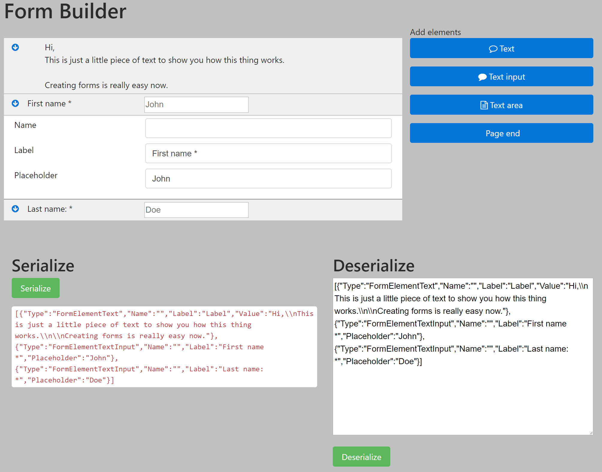

# Form Builder
Create a form by easily dragging and dropping form elements.

Default form elements supported:
---
Plugins:
- Text (line)
- Text area
- Checkbox
- Select field
- Radio buttons
- Score element
- Static text
- Page end

You can easily write your own, and more will be added in the future.

Screenshot
---
